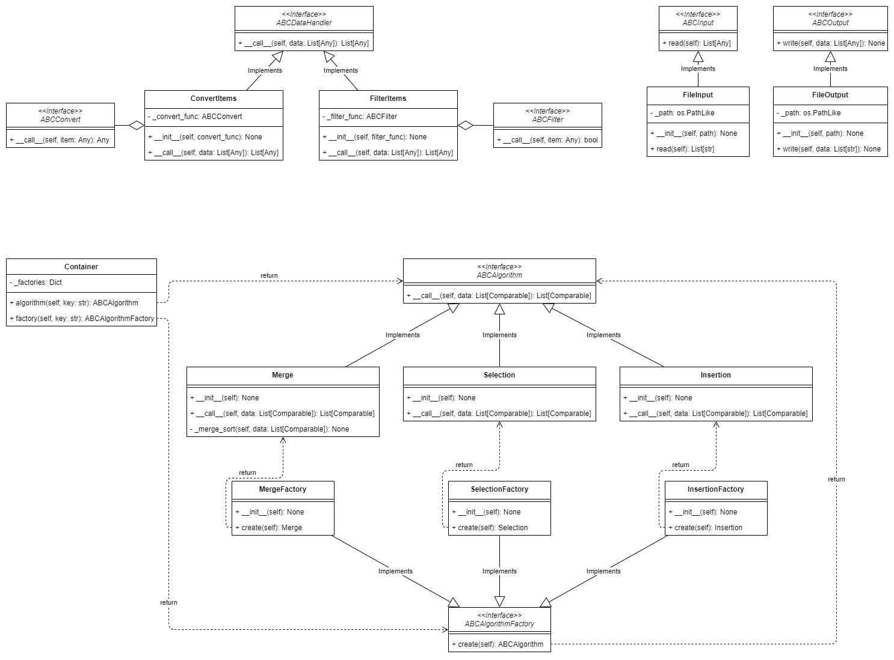

# Initialization
## Clone project
```
git clone https://github.com/yari61/otus-patterns-factory.git
cd otus-patterns-factory
```

## Virtual environment
It is recommended to create a virtual environment at first (.venv for example)
```
python -m venv .venv
```

Then activate it with 
- ```source .venv/bin/activate```
on Unix-like systems, or
- ```.venv\bin\activate```
if Your system runs Windows

## Installation
To install the package run the next command in your virtual environment
```
pip install -e .
```

## Testing
To run tests execute the next command
```
python -m unittest
```

# Project description
This project is useful for sorting numerical datasets.

It implements a simple command line interface

```
python -m sorting <algorithm_name> <path_to_input> <path_to_output>
```

Where algorithm could take one of these values:
- insertion
- selection
- merge

## Example
To sort data from the file ``input.txt`` and output a result to the file ``output.txt`` with merge sort algorithm, we should run the next command
```
python -m sorting merge input.txt output.txt
```

## Class diagram

